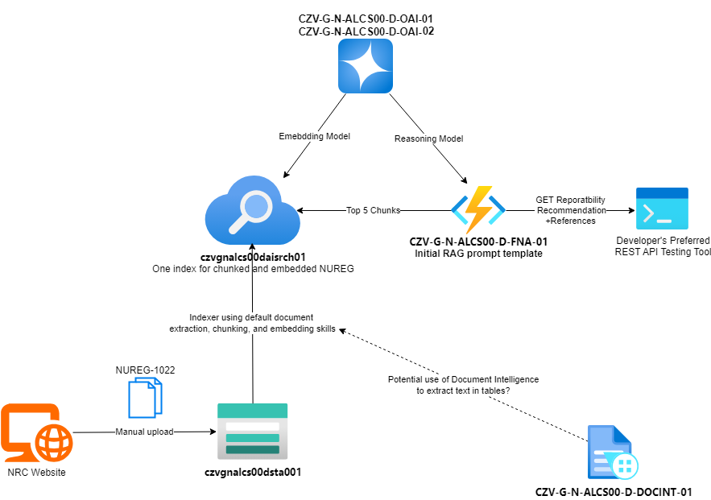

# 002. Start with a Baseline Reportability Recommendation using NUREG-1022

Date: 04-02-2025

## Status

Proposed

## Context

At the time of writing this ADR, there are ongoing blockers with RAI process and using ECI data with Azure AI Services.
There are also so many disparate data sources to comb through, that it may be a good path forward to implement a
baseline reportability recommendation tool with one data source to get a skeleton in place for the larger AskLicensing
solution. This ADR outlines that baseline reportability recommendation tool - the Azure architecture to support it and
the data flow through the system.

## Decision

We will implement the below architecture as our "first phase" for the AskLicensing solution. This architecture allows us
to use non-ECI data while RAI is a blocker. The Reportability manual seemed to be highest priority document Shift
Managers use to make a reportability call; however, that manual is considered ECI. So, the next best thing is NUREG-1022
since it is often referenced in the Reportabilit manual. By implementing this "first phase", this will also allow us to
begin designing and implementing an evaluation framework for the solution.

