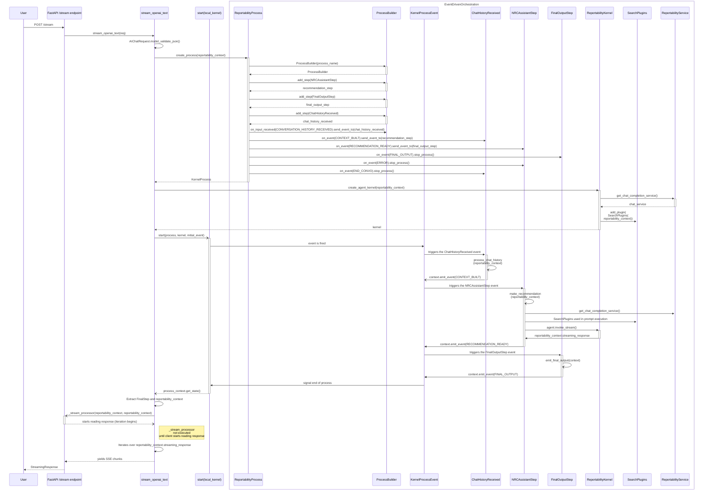

```mermaid
sequenceDiagram
    participant User as User
    participant API as FastAPI /stream endpoint
    participant Handler as stream_openai_text
    participant Runtime as start(local_kernel)
    box EventDrivenOrchestration #DDEEFF
        participant Process as ReportabilityProcess
        participant Builder as ProcessBuilder
        participant Event as ReportabilityEvent
        participant ChatHistory as ChatHistoryReceived
        participant NRC as NRCAssistantStep
        participant Final as FinalOutputStep
        participant Kernel as ReportabilityKernel
        participant Event as KernelProcessEvent
        participant Plugins as SearchPlugins
        participant Service as ReportabilityService
    end

    User->>API: POST /stream
    API->>Handler: stream_openai_text(req)
    Handler->>Handler: AIChatRequest.model_validate_json()
    Handler->>+Process: create_process(reportability_context)
    Process->>+Builder: ProcessBuilder(process_name)
    Builder-->>-Process: ProcessBuilder
    Process->>+Builder: add_step(NRCAssistantStep)
    Builder-->>-Process: recommendation_step
    Process->>+Builder: add_step(FinalOutputStep)
    Builder-->>-Process: final_output_step
    Process->>+Builder: add_step(ChatHistoryReceived)
    Builder-->>-Process: chat_history_received
    Process->>Builder: on_input_received(CONVERSATION_HISTORY_RECEIVED).send_event_to(chat_history_received)
    Process->>ChatHistory: on_event(CONTEXT_BUILT).send_event_to(recommendation_step)
    Process->>NRC: on_event(RECOMMENDATION_READY).send_event_to(final_output_step)
    Process->>Final: on_event(FINAL_OUTPUT).stop_process()
    Process->>NRC: on_event(ERROR).stop_process()
    Process->>+ChatHistory: on_event(END_CONVO).stop_process()
    Process-->>-Handler: KernelProcess
    Handler->>+Kernel: create_agent_kernel(reportability_context)
    Kernel->>+Service: get_chat_completion_service()
    Service-->>-Kernel: chat_service
    Kernel->>+Plugins: add_plugin(<br/>SearchPlugins(<br/>reportability_context))
    Kernel-->>-Handler: kernel
    Handler-)+Runtime: start(process, kernel, initial_event)
    Runtime->>Event: event is fired
    Event->>+ChatHistory: triggers the ChatHistoryReceived event
    ChatHistory-)ChatHistory: process_chat_history<br/>(reportability_context)
    ChatHistory-)-Event: context.emit_event(CONTEXT_BUILT)
    Event->>+NRC: triggers the NRCAssistantStep event
    NRC-)NRC: make_recommendation <br/> (reportability_context)
    NRC->>+Service: get_chat_completion_service()
    NRC->>Plugins: SearchPlugins used in prompt execution
    NRC->>+Kernel: agent.invoke_stream()
    Kernel->>-NRC: reportability_context.streaming_response
    NRC->>-Event: context.emit_event(RECOMMENDATION_READY)
    Event->>+Final: triggers the FinalOutputStep event
    Final-)Final: emit_final_output(context)
    Final->>-Event: context.emit_event(FINAL_OUTPUT)
    Event->>Runtime: signal end of process
    Runtime--)-Handler: process_context.get_state()
    Handler->>Handler: Extract FinalStep and reportability_context
    Handler-)+API: _stream_processor(reportability_context, reportability_context)
    API--)-Handler: starts reading response (iteration begins)
    Note right of Handler: _stream_processor <br/> not executed <br/> until client starts reading response
    Handler->>Handler: Iterates over reportability_context.streaming_response
    Handler-->>API: yields SSE chunks
    API-->>User: StreamingResponse
```
