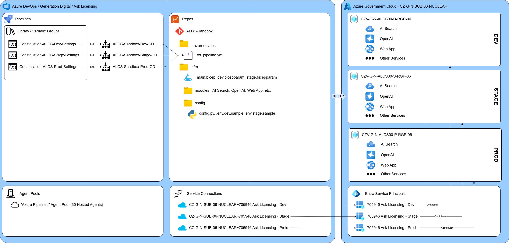

# Deployment Process

This document outlines the steps necessary to deploy the "Ask Licensing" solution to a new Azure Resource Group in
Constellation's Azure Government Cloud tenant.  This is the process we will use to deploy the solution into the
Staging resource group, but it should also be the process needed to deploy into the Production resource group.

The following diagram gives an overview of the various resources involved in deploying the solution to a target
environment in Azure:



## Identify the Target Resource Group

At the time this is being written the development, staging and production resource groups have already been created.

- Development: [CZV-G-N-ALCS00-D-RGP-06](https://portal.azure.us/#@cgazg.onmicrosoft.us/resource/subscriptions/e36c3be6-c325-4f1b-8c73-3afe998578b8/resourceGroups/CZV-G-N-ALCS00-D-RGP-06)
- Staging: [CZV-G-N-ALCS00-S-RGP-06](https://portal.azure.us/#@cgazg.onmicrosoft.us/resource/subscriptions/e36c3be6-c325-4f1b-8c73-3afe998578b8/resourceGroups/CZV-G-N-ALCS00-S-RGP-06)
- Production: [CZV-G-N-ALCS00-P-RGP-06](https://portal.azure.us/#@cgazg.onmicrosoft.us/resource/subscriptions/e36c3be6-c325-4f1b-8c73-3afe998578b8/resourceGroups/CZV-G-N-ALCS00-P-RGP-06)

The person(s) performing the initial deployment will need [Contributor](https://learn.microsoft.com/en-us/azure/role-based-access-control/built-in-roles/privileged#contributor)
access to the target resource group.

## Create the Environment Variable and Bicep Parameter Files

There are a couple of files in the repository that need to be created with values specific to the target environment.

For each of these, create a new copy of the file with the target environment name (e.g., `dev`, `stage`, `prod`) in the
name, and then update the file with the appropriate values for your target environment, making sure to NOT include any
keys or secrets in the `*.sample` file that gets checked into the repository.

- `/infra/{ENV}.bicepparam`
- `/infra/config/env.{ENV}.sample`

## Initial Manual Deployment

Before we can configure the Azure DevOps pipeline to deploy into the target resource group, we will need to first
manually deploy the resources so that we can store some secrets there for use in configuring Azure DevOps

Follow the steps to [Ask Licensing Infrastructure as Code - Manually Running IaC from Local](../infra/README.md#manually-running-iac-from-local)
to deploy to the resources manually, making sure to use the correct `*.bicepparam` file for your target environment.

## Configure Role Based Access Control

Role Base Access Control (RBAC) role assignments must be performed by Constellation staff, and can not be deployed
via bicep.

The Role assignments needed for all of the "Ask Licensing" project environments (dev, stage, prod) are Excel Spreadsheet
in the following document in Teams:

[Ask Licensing Co-Development - Documents\Architecture and SEP Process\GOV ALCS-RBAC Roles.xlsx](https://cgazc.sharepoint.com/:x:/r/sites/AskLicensingCo-Development/Shared%20Documents/Documents/Architecture%20and%20SEP%20Process/GOV%20ALCS-RBAC%20Roles.xlsx?d=wda5183b9efff4f8fb70e37b746ee99a1&csf=1&web=1&e=uY5rR3).

1. Ensure that the Spreadsheet has been updated for your target environment
    - Ensure that the necessary individuals are assigned the
      [Key Vault Data Access Administrator](https://learn.microsoft.com/en-us/azure/role-based-access-control/built-in-roles/security#key-vault-data-access-administrator)
      role on the Key Vault instance in the target environment, we'll need that below

1. Create a
  [ServiceNow Generic Request](https://ceg.service-now.com/sp?id=sc_cat_item&sys_id=7e481077134e3240f4cbb3776144b0d0)
  with the following details:

    - Your Constellation contact details
    - Location: "**Telecommuter {Your State}**" or an appropriate Constellation location
    - Category: "**Access**"
    - Sub-Category: "**Request Assistance**"
    - Is this request Application specific?: "**Yes**"
    - Please select the Application: "**Ask Licensing**"
    - Assignment Group: "**IT-CEG-TechOps-Directory Services-DS Tier 2**"
    - Priority: "**3**"
    - Descripe your requirement in detail: Use something like the following, with appropriate resource names...

        ```text
        The following request is for
        SUBSCRIPTION: CZ-G-N-SUB-06-NUCLEAR
        RESOURCE GROUP: CZV-G-N-ALCS00-S-RGP-06

        Please perform the RBAC role assignments for the Ask Licensing Stage environment
        as defined in the attached spreadsheet.
        ```

    - Click the "Attachments" link at the bottom of the form, and attach the updated
      [GOV ALCS-RBAC Roles.xlsx](https://cgazc.sharepoint.com/:x:/r/sites/AskLicensingCo-Development/Shared%20Documents/Documents/Architecture%20and%20SEP%20Process/GOV%20ALCS-RBAC%20Roles.xlsx?d=wda5183b9efff4f8fb70e37b746ee99a1&csf=1&web=1&e=uY5rR3)
      Spreadsheet

## Manually deploy the Azure OpenAI Models

Currently, the bicep does not include the actual Azure OpenAI models because we need to ensure that the necessary
capacity is available before deploying the models.

Work with the appropriate Constellation resources to deploy the necessary models to the newly provisioned Azure OpenAI
instance in the target environment.

Currently, those models include:

- `ada-2`
- `ada-3`
- `gpt-4o`

## Build the Indexes

We'll need to manually build the indexes in Azure AI Search.

**_You will not be able to build the indexes successfully until the ServiceNow ticket that was submitted in the
[Configure Role Based Access Control](#configure-role-based-access-control) step above has been completed.  This is because
the Document Intelligence instance needs read access to the storage account in order to build some of the indexes.  Once
that request has been completed you can continue_**

To build the indexes:

- Place the source documents in the correct subfolders under the `non-eci` and `eci` containers in the newly provisioned
  Azure Storage containers.
- Open the Azure Search instance in the portal
- Navigate to the "Indexers" page for the AI Search instance
- For each indexer
  - Click on the indexer to open it
  - Click the "Run" button along the top

## Identify the Environment's Service Principal

An Azure Service Principal with the
[Contributor](https://learn.microsoft.com/en-us/azure/role-based-access-control/built-in-roles/privileged#contributor)
role assigned on the target resource group is needed for the Azure DevOps Pipeline to use.

At the time this is being written, the service principals for the Development, Staging and Production have already
been created:

- Development: [705946 Ask Licensing - Dev](https://portal.azure.us/#view/Microsoft_AAD_RegisteredApps/ApplicationMenuBlade/~/Overview/appId/f900ff49-becc-44ea-9bcc-070b2a1d6a9f)
- Staging: [705946 Ask Licensing - Stage](https://portal.azure.us/#view/Microsoft_AAD_RegisteredApps/ApplicationMenuBlade/~/Overview/appId/2791a6b9-7b3b-4580-9fcd-a588fa6604e2)
- Production: [705946 Ask Licensing - Prod](https://portal.azure.us/#view/Microsoft_AAD_RegisteredApps/ApplicationMenuBlade/~/Overview/appId/bd66fbcf-e37a-48c7-9cfa-0e8c122ea932)

Identify the correct Service Principal from the list above or if need be, work with the proper Constellation resources
to provision a Service Principal that has Contributor access to the environment's [resource group](#identify-the-target-resource-group)

Finally work with the appropriate Constellation resources to obtain the Service Principal's "Secret" so it can be
stored in the Azure Key Vault in the next step.

## Manage Azure Key Vault Access and Store the Service Principal Secret

To be able to safely and securely store the secret for the Service Principal used to deploy resources via Azure DevOps,
one or more people with access to the secret needs to be given permissions to the Azure Key Vault that was deployed
manually in the previous [Initial Manual Deployment](#initial-manual-deployment). This is a three step process:

1. In the [Configure Role Based Access Control](#configure-role-based-access-control) section above,
   a ServiceNow ticket was submitted that requested that included the individuals that should be assigned the
   [Key Vault Data Access Administrator](https://learn.microsoft.com/en-us/azure/role-based-access-control/built-in-roles/security#key-vault-data-access-administrator)
   role in the target environment.  **_That ServiceNow ticket MUST be completed before you can continue._**

1. Once that Ticket has completed, and the "Key Vault Data Access Administrator" role has been assigned (it could take
   multiple days), that person can then assign themselves (and/or others) the
   [Key Vault Secrets Officer](https://learn.microsoft.com/en-us/azure/role-based-access-control/built-in-roles/security#key-vault-secrets-officer)
   role to be able to manage secrets and their values.  They can either:

    - Assign the role to the appropriate user via the Azure portal on the target Key Vault's "Access Control" page

      OR

    - Use the following script to assign the role using the Azure CLI, replacing the `PRINCIPAL` and `KEY_VAULT`
      variable values with the appropriate `Z0` email for the target user, and the name of the Key Vault:

      > **Note**: See [Ask Licensing Infrastructure as Code - Manually Running IaC from Local](../infra/README.md#manually-running-iac-from-local)
      for instructions on logging into the Azure CLI

      ```bash
      PRINCIPAL="{The Constellation Z0XXXXXX@cgazg.onmicrosoft.us email for the person to assign the role to}"
      KEY_VAULT="{The Key Vault Name, e.g. CZV-G-N-ALCS00-S-KV-01}"
      ASSIGNEE=$(az ad user show --id "${PRINCIPAL}" --query "id" --output tsv)
      ROLE=$(az role definition list --name "Key Vault Secrets Officer" --query "[].name" -o tsv)
      SCOPE=$(az keyvault show --name "${KEY_VAULT}" --query id -o tsv)
      az role assignment create --assignee "$ASSIGNEE" --role "$ROLE" --scope "$SCOPE"
      ```

1. The person with they "Key Vault Secrets Officer" assigned above, can store the value for the
   `ServicePrincipalSecret` "Secret" in the Key Vault, they can do that either:

    - By opening the target Key Vault resource in the portal:
        - Open the "Secrets" Page
        - Clicking on the "**ServicePrincipalSecret**" secret
        - Clicking the "**+ New Version**"
        - Pasting the Service Principal's secret into the "**Secret value**" text box
        - Clicking the "**Create**" button at the bottom of the page.

      OR

    - Use the following bash shell commands to set the secret value, updating the `$KEY_VAULT` variable with the
      name of the target key vault, and pasting the `ServicePrincipalSecret` value in when prompted.
      **_This script will NOT show the secret on the screen_**:

      ```bash
      KEY_VAULT="{The Key Vault Name, e.g. CZV-G-N-ALCS00-S-KV-01}"
      SECRET_NAME="ServicePrincipalSecret" # pragma: allowlist secret - bypass the detect-secret flag on sample value
      read -r -s -p "Enter the ServicePrincipalSecret value: " SECRET_VALUE
      az keyvault secret set --vault-name "$KEY_VAULT" --name "$SECRET_NAME" --value "$SECRET_VALUE" > /dev/null
      ```

1. Finally and optionally, the person with the "Key Vault Data Access Administrator" can assign the
   [Kev Vault Secrets User](https://learn.microsoft.com/en-us/azure/role-based-access-control/built-in-roles/security#key-vault-secrets-user)
   role to any users that need to be able to read secrets.

## Create the Azure DevOps Service Connection

To create the Azure DevOps Service Connection, you need to complete a ServiceNow
[Azure DevOps Service Connection](https://ceg.service-now.com/sp?id=sc_cat_item&sys_id=058b3d661b1e185064762f876e4bcb22)
request for the DevOps team to complete.

You'll need to know the following details, you can retrieve them either by:

- Navigating to the appropriate resources in the portal

  - The [Azure Tenant ID](https://portal.azure.us/#view/Microsoft_AAD_IAM/ActiveDirectoryMenuBlade/~/Overview)
  - The [Azure Subscripton Name & ID](https://portal.azure.us/#view/Microsoft_Azure_Billing/SubscriptionsBladeV2)
  - The Service Principal Name & App ID.  Use the links in the
    [Identify the Environment's Service Principal](#identify-the-environments-service-principal) section above

  OR

- You can use the following bash script to retrieve them, replacing the `$SERVICE_PRINCIPAL_NAME` with the name of
  the [Service Principal you identified above](#identify-the-environments-service-principal):

    > **Note**: See [Ask Licensing Infrastructure as Code - Manually Running IaC from Local](../infra/README.md#manually-running-iac-from-local)
    for instructions on logging into the Azure CLI

    ```bash
    SERVICE_PRINCIPAL_NAME="{Your Service Principal Name, e.g. 705946 Ask Licensing - Stage}"
    TENANT_ID=$(az account show --query "tenantId" -o tsv)
    SUBSCPRIPTION_ID=$(az account show --query "id" -o tsv)
    SUBSCRIPTION_NAME=$(az account show --query "name" -o tsv)
    SP_APP_ID=$(az ad sp list --display-name "${SERVICE_PRINCIPAL_NAME}" --query "[].{spID:appId}" --output tsv)
    echo
    echo "Tenant ID                 : $TENANT_ID"
    echo "Subscription ID           : $SUBSCRIPTION_ID"
    echo "Subscription Name         : $SUBSCRIPTION_NAME"
    echo "Service Principal Name    : $SERVICE_PRINCIPAL_NAME"
    echo "Service Princiapal App ID : $SP_APP_ID"
    ```

Make sure to include the following information in the request:

- Description (You could add the Azure Tenant, Subscription, and Service Principals here as well), e.g.:

    ```text
    Please create an Azure DevOps Service Connection for the "Ask Licensing" staging environment using the
    "705946 Ask Licensing - Stage" service principal. Please reach out to the requestor for the Service Principal
    Secret.

    Tenant ID                 : {RETRIEVED ABOVE}"
    Subscription ID           : {RETRIEVED ABOVE}"
    Subscription Name         : {RETRIEVED ABOVE}"
    Service Principal Name    : {RETRIEVED ABOVE}"
    Service Princiapal App ID : {RETRIEVED ABOVE}"
    ```

- Azure DevOps Project: Generation Digital / Ask Licensing
- Service Connection Name: "**CZ-G-N-SUB-06-NUCLEAR~705946 Ask Licensing - {Your Environment: Dev, Stage, Prod}**"
- Environment: "**{Your Environment: Dev, Stage, Prod}**"

They will also need to know the Service Principal Secret, but that shouldn't be included in the requst for security
purposes. We shared the secret with the engineer completing the request via chat in Teams, then deleted the secret from
the chat once they had created the service connection.

## Create the Azure DevOps Variable Group

Next, we need a Variable Group for the target environment.

- Open the list of [Variable Groups](https://dev.azure.com/ConstellationADO/Generation%20Digital/_library?itemType=VariableGroups)
- Click on the vertical ellipses ("⋮") to the right of one of the existing `Constellation-ALCS-{ENV}-Settings`
  variable group names, and select "**Clone**" from the pop-up menu.
- Update the variable group name with the correct environment
- Update the values for the variables and secrets with the appropriate values for the target environment
- **MAKE SURE TO CLICK THE "Save" BUTTON AT THE TOP WHEN YOU ARE DONE**

## Create the Azure DevOps Pipeline

Next, create a new Azure DevOps Pipeline "object" that references the `.azuredevops/cd_pipeline.yml` file:

- Open the [Pipelines page in Azure DevOps](https://dev.azure.com/ConstellationADO/Generation%20Digital/_build)
- Click the "New Pipeline" button in the top right corner
- Click:
  - Azure Repos Git
  - ALCS Sandbox
  - Existing Azure Pipelines YAML File
-Select:
  - Branch: `develop`
  - Path: `/.azuredevops/cd_pipeline.yml` (in the drop down)
  - Click "**Continue**"
  - On the "Review your Pipeline YAML" page, click the drop-down arrow next to the "Run" button in the top right corner,
  and click "**Save**"
- Next, we need to re-name the new pipline.  Click the vertical ellipses ("⋮") button in the top right corner of the
  page, and click "**Rename/move**" from the pop-up menu.
  - Change the name to "**ALCS-Sandbox-{ENV}-CD**" using the target environment as the "**{ENV}**".
  - Click the ellipsis ("…") next to the path, and select the "Ask Licensing" folder
  - Click the "**Save**" button
- Finally, we need to link the Variable Group we created above to the new pipeline. The steps to do this are a little
  confusing, but they work.  To link the variable group:
  - Click the "Edit" button in the top right corner of the page (re-open the "ALCS-Sandbox-{ENV}-CD" page if you
    closed it)
  - Click the vertical ellipses ("⋮") button in the top right corner of the
    page, and click "**Triggers**" from the pop-up menu.
  - Click the "**Variables**" tab along the top
  - Select "**Variable Groups**"
  - Click the "**Link Variable Group**"" button
  - From the list on the right, select the "**Constellation-ALCS-{ENV}-Settings**" variable group that you created above
  - Click the "**Link**" button.
  - Save the updated pipeline by clicking on the dropdown arrow next to the  "**Save & queue**" button along the
  top, and selecting "**Save**" from the drop-down menu
    - In the pop-up window, you can add a description of the change to the "Comment" box, e.g., "Linked variable group"
    - Click the "**Save**" Button

## Configure the Virtual Networks & Private Endpoints

Virtual Networks and Private Endpoints at Constellation must be provisioned by the Constellation team not via bicep.
To request the VNets and Private Endpoints be created:

1. Create a
  [ServiceNow Generic Request](https://ceg.service-now.com/sp?id=sc_cat_item&sys_id=7e481077134e3240f4cbb3776144b0d0)
  with the following details:

    - Your Constellation contact details
    - Location: "**Telecommuter {Your State}**" or an appropriate Constellation location
    - Category: "**Software**"
    - Sub-Category: "**Update Assistance**"
    - Is this request Application specific?: "**Yes**"
    - Please select the Application: "**Ask Licensing**"
    - Assignment Group: "**IT-Corporate-Hosting-Azure Platform Engineering**"
    - Priority: "**3**"
    - Descripe your requirement in detail: Use something like the following, with appropriate resource names...

        ```text
        The following request is for
        SUBSCRIPTION: CZ-G-N-SUB-06-NUCLEAR
        RESOURCE GROUP: CZV-G-N-ALCS00-S-RGP-06

        Please create the VNet for the resource group and add Private Endpoints for the following Services:

        API Management        : CZA-G-N-ALCS00-S-APIM-01
        Azure OpenAI          : CZA-G-N-ALCS00-S-OAI-01
        Document Intelligence : CZV-G-N-ALCS00-S-DOCINT-01
        Key Vault             : CZV-G-N-ALCS00-S-KV-01
        AI Search             : czagnalcs00saisrch01
        App Service           : CZV-G-N-ALCS00-S-APP-01
        ```
