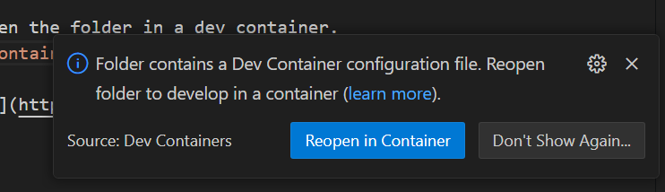
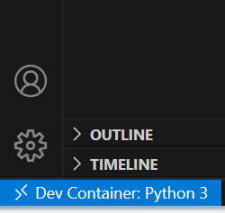

# Getting Started

## Prerequisites For Windows

- [WSL2 with latest Ubuntu Image](https://learn.microsoft.com/en-us/windows/wsl/install#install-wsl-command)
- [Docker Installed on Ubuntu Image](https://docs.docker.com/engine/install/ubuntu/#install-using-the-repository)
  - Open an Ubuntu terminal using wsl and then follow the docker installation instructions for installing in the apt repository.
- [VSCode](https://code.visualstudio.com/download)
- [Install WSL Extensions for VSCode](https://marketplace.visualstudio.com/items?itemName=ms-vscode-remote.remote-wsl)
- [Install Remote Development Extensions for VSCode](https://marketplace.visualstudio.com/items?itemName=ms-vscode-remote.vscode-remote-extensionpack)

## Installing Repo

1. Configure Git in WSL and download Git for Windows, follow instructions [here](https://learn.microsoft.com/en-us/windows/wsl/tutorials/wsl-git).
Make sure Git Credential Manager is setup and that the [additional configuration for Azure](https://learn.microsoft.com/en-us/windows/wsl/tutorials/wsl-git#additional-configuration-for-azure)
is done.
2. Open an Ubuntu terminal, by running WSL

    ```Powershell
    wsl
    ```

3. Make sure you are in the home directory

    ```bash
    cd ~
    ```

4. (Optional) Create a new directory for repos

    ```bash
    mkdir repos
    cd repos
    ```

5. Clone the repository

    ```bash
    git clone https://ConstellationADO@dev.azure.com/ConstellationADO/Generation%20Digital/_git/ALCS-Sandbox
    ```

6. Once the repo is cloned, `cd` into the repo folder and open Visual Studio Code using the following command.
This will open the folder as a WSL workspace in VSCode.

    ```bash
    code .
    ```

For more information on developing using WSL and VSCode can be found [here](https://code.visualstudio.com/docs/remote/wsl).

## Running the Dev Container

Once VSCode has opened the repo workspace, there are several ways to reopen the folder in a dev container.
One way is to open the VSCode Command Pallette (`F1`) and type in the `Dev Containers: Reopen In Container` command.
You may also be prompted with a dialog box to do the same thing



Wait a few minutes for the container to build and then you should be ready to develop!

VSCode will automatically reopen the folder in the container, you can confirm what environment you are
working in by looking at the lower left corner of the VSCode window.



More information on working with Dev Containers in VSCode can be found [here](https://code.visualstudio.com/docs/devcontainers/containers).
