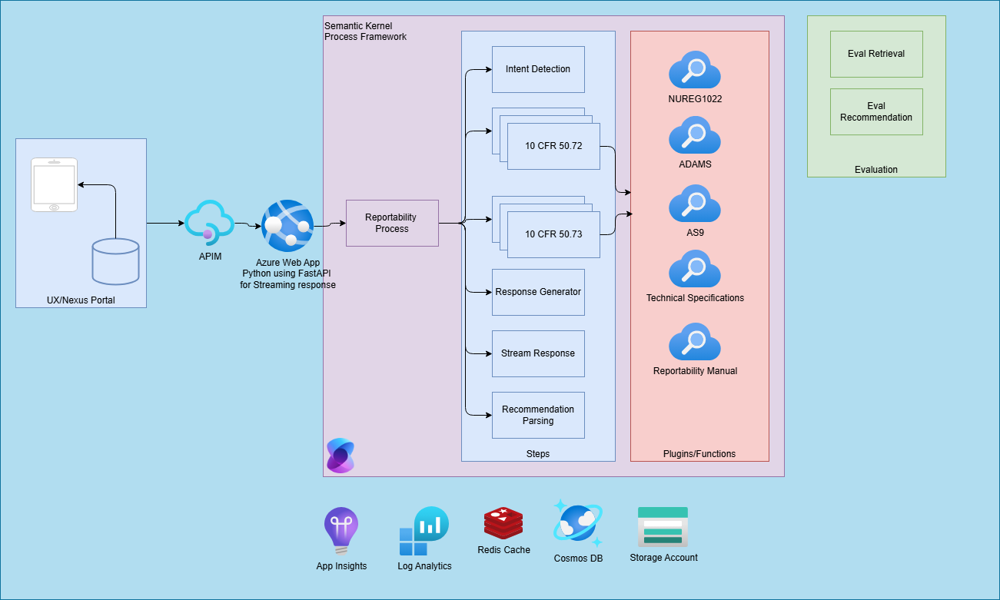

# ReportabilityProcess Framework

The `ReportabilityProcess` class implements a structured workflow for handling reportability-related events using the
`ProcessBuilder` from the Semantic Kernel library. Below is an overview of its design and implementation.

## Overview

The `ReportabilityProcess` defines a modular and event-driven process framework. It consists of multiple steps and
transitions triggered by specific events, ensuring a clean and maintainable workflow.

## Key Components

1. **ProcessBuilder**:
   - Orchestrates the process by defining steps and event transitions.
   - The process is named `ReportabilityProcess` by default.

2. **Steps**:
   - `UserInputReceived`: Entry point that handles a single user message, by creating a new ReportabilityContext and
   adding the single message to the message_history.
   - `ChatHistoryReceived`: Entry point that handles a the full chat history, by creating a new ReportabilityContext and
   adding the all of the messages to the message_history.
   - `NRCAssistantStep`: Defines the agent that is used to handle interactions with the NUREG Search index.
   It is currently what is making the recommendation on reportability.
   - `FinalOutputStep`: Used to centralize the coupling that must occur bewteen the process frame work and the system
   calling it's ability to obtain the final ReportabilityContext state.

3. **Events**:
   - Defined in `ReportabilityEvents` and used to trigger transitions between steps.
   - Examples include `USER_INPUT_RECEIVED`, `INTENT_PARSED`, `RECOMMENDATION_READY`, and `FINAL_OUTPUT`.

## Kernels

The `ReportabilityKernel` class provides two key kernel configurations for interacting with Azure OpenAI services.
These kernels are used to facilitate AI-driven tasks within the `ReportabilityProcess` framework.

1. **Process Kernel**:
    - Configured using the `create_process_kernel` method.
    - Used for managing the process frameworks construction.

2. **Search Kernel**:
    - Configured using the `create_search_kernel` method.
    - Includes both `AzureChatCompletion` and `AzureTextEmbedding` services.
    - Adds a `SearchPlugins` plugin for advanced search capabilities.
    - Designed for tasks that involve embedding-based searches and retrievals.

Both kernels are modular and can be extended or customized to support additional AI services or plugins as needed.

## SearchPlugins Overview

The `SearchPlugins` class provides a plugin for performing advanced search operations using Azure AI Search.
It is integrated into the `ReportabilityProcess` framework to facilitate embedding-based searches within the
NUREG 1022 index.

### Key Features

1. **Kernel Function**:
    - Implements the `search_nureg` kernel function.
    - Allows searching for relevant information from NUREG 1022 based on user-provided search terms.

2. **Azure AI Search Integration**:
    - Utilizes Azure AI Search for vector-based retrieval.
    - Configured with environment variables for the service endpoint, index name, and API key.

3. **Asynchronous Search**:
    - Performs asynchronous searches using the `vectorizable_text_search` method.
    - Returns a list of relevant text chunks from the search results.

### Code Highlights

- **Environment Configuration**:
  - Reads Azure Search configuration from environment variables (`AZURE_SEARCH_SERVICE_ENDPOINT`,
  `AZURE_SEARCH_NUREG_INDEX_NAME`, `AZURE_SEARCH_API_KEY`).

- **Search Execution**:
  - Uses `AzureAISearchCollection` to perform vector-based searches.
  - Processes results asynchronously to extract relevant information.

This plugin enhances the `ReportabilityProcess` by enabling efficient and accurate retrieval of regulatory information,
ensuring compliance and informed decision-making.

## Current Process Flow

1. **Input Events**:
   - `USER_INPUT_RECEIVED` triggers the `UserInputReceived` step.
   - `CONVERSATION_HISTORY_RECEIVED` triggers the `ChatHistoryReceived` step.

2. **Step Transitions**:
   - `UserInputReceived` emits `INTENT_PARSED`, which triggers `NRCAssistantStep`.
   - `ChatHistoryReceived` also emits `INTENT_PARSED`, leading to `NRCAssistantStep`.

3. **Finalization**:
   - `NRCAssistantStep` emits `RECOMMENDATION_READY`, triggering `FinalOutputStep`.
   - `FinalOutputStep` emits `FINAL_OUTPUT`, stopping the process.

4. **Error Handling**:
   - `NRCAssistantStep` emits `ERROR`, stopping the process.
   - `UserInputReceived` emits `END_CONVO`, also stopping the process.

## Design Principles

- **Modularity**: Each step is encapsulated as a separate class, making the process reusable and maintainable.
- **Event-Driven**: Transitions between steps are triggered by well-defined events, ensuring loose coupling.
- **Extensibility**: New steps or events can be added without modifying the existing process structure.

## Code Example

The process is created using the `create_process` method:

```python
process_builder = ProcessBuilder(process_name)
user_input_received = process_builder.add_step(UserInputReceived)
recommendation_step = process_builder.add_step(NRCAssistantStep)
final_output_step = process_builder.add_step(FinalOutputStep, name="FinalStep")
chat_history_received = process_builder.add_step(ChatHistoryReceived)

# Event-driven transitions
process_builder.on_input_event(ReportabilityEvents.USER_INPUT_RECEIVED).send_event_to(user_input_received)
user_input_received.on_event(ReportabilityEvents.INTENT_PARSED).send_event_to(recommendation_step)
# ...additional transitions...
```

This design ensures a clean, maintainable, and extensible implementation of the process framework.

## Potential Future State

This represents the first pass current state of the Process Framework's implementation. A potential future state of this
invloves the fanning out of recommendations to the NRC Assistant, one for each subsection of 10 CFR 50.72
and 10 CFR 50.73.


