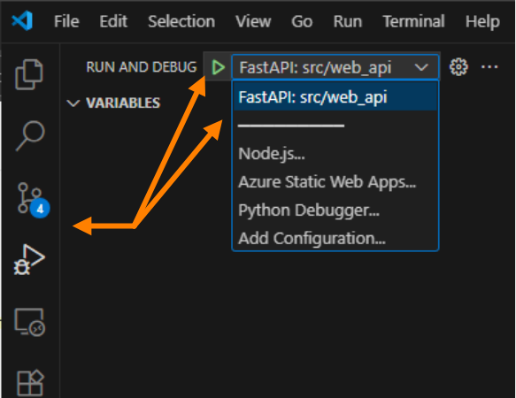
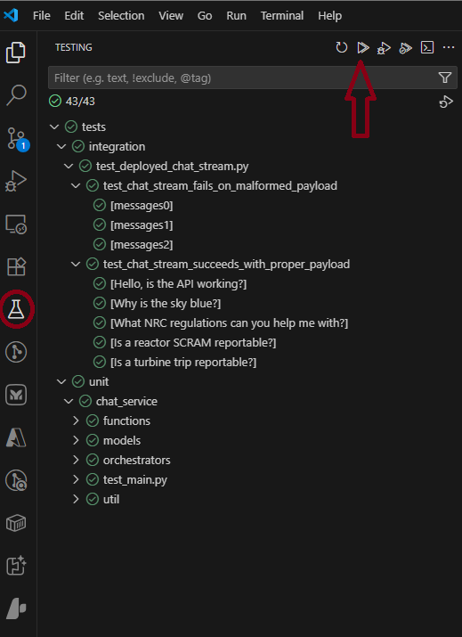

# Working with the Chat Service Web App Locally

This document explains how to work with the Web API locally in the VSCode Dev Container development
environment. Topics covered include:

- [Running (Debugging) the Web App Locally](#running-debugging-the-web-app-locally)
- [Interacting with the Local Web App](#interacting-with-the-local-web-app)
- [Using Aspire Dashboard Locally](#using-aspire-dashboard-locally)

## Running (Debugging) the Web App Locally

### Pre-Requisites

The best and easiest way to run the Web App locally is to use the Dev Container in VSCode. See
[Getting Started](../../doc/getting-started.md) for instructions.

Additionally, endpoint specific dependencies can be found in the documentation for each endpoint:

- [Chat Service](./chat_service/README.md#pre-requisites)
- [NUREG Search Skill](./nureg_search/README.md#getting-started)
- [Reportability Manual Search Skill](./reportability_manual_search/README.md#getting-started)

### Preparing to run locally

- Open a terminal in VSCode (select "**Terminal**" | "**New Terminal**" from the VSCode menu)
- Change into the `src/web_api` folder:

    ``` bash
    cd src/web_api
    ```

- Install the required python packages:

    ``` bash
    pip install -r requirements.txt
    ```

- **_If you don't have already have a `.env` file_**, copy the `.env.sample` file to a
  new file in the same directory named `.env`.

    ```bash
    # ONLY RUN THIS IF YOU DON'T ALREADY HAVE A .env FILE
    cp env.sample .env
    ```

  - Open the new `.env` file in VSCode, and update the values in the new file to match your
    deployed resources in Azure.
  - For each dependency, you can open the resource in the [Azure Portal](https://portal.azure.us),
    copy the required value, and paste it into the `.env` file.
  - If you already had a `.env` file, you should inspect the `.env.sample` file
    for any new settings that may have been added since your file was created.
- If you want to view the web app telemetry locally, you should follow the
  [Using Aspire Dashboard Locally](#using-aspire-dashboard-locally) steps.

### Debugging the Web App Locally

- To begin a debug session press "**F5**" on the keyboard (the VSCode keyboard shortcut to start a debug session) or go
  into your "Run and Debug" panel and click the "play" button. It should automatically allow you to debug as well based
  on the configs in the `.vscode/launch.json` file.
    > **Note**: To learn more about debugging python in VSCode, see
    [Python debugging in VS Code](https://code.visualstudio.com/docs/python/debugging)

    

## Interacting with the Local Web App

### Using the VSCode "REST Client" Extension

The ["REST Client" extension for VSCode](https://marketplace.visualstudio.com/items?itemName=humao.rest-client)
makes it easy to create a text file with your http request details, send the request, and view the responses. Each
endpoint has an example test in the [/src/web_api/tests/integration](../tests/web_api/integration) folder. Once the
Web App is running locally, and all other requirements for the endpoint are functioning, the endpoint can be tested
by opening the `*.rest` file and clicking on the "Send Request" link that appears above the word `POST` on the top line:
  > **Note**: The "**Send Request**" link may appear at the beginning or at the end of the line.
  You can also **right-click** on the `POST` keyword, and select "**Send Request**" from the pop-up menu,
  or use the `CTRL-ALT-R` keyboard shortcut while in the file to send the request.

  

## Deploy Web App

You should only deploy the Web App into an Azure Environment by using the Azure DevOps pipeline create for
the environment you are publishing to. You should never deploy the Web App directly from your local environment.
Review [View and Manage your pipeline](https://learn.microsoft.com/en-us/azure/devops/pipelines/create-first-pipeline?view=azure-devops&tabs=python%2Cbrowser#view-and-manage-your-pipelines)
for more information on running pipelines. The pipeline defined for this web app use the naming convention
"ALCS-Sandbox-{Environment}-CD". Ensure you select the branch you wish to deploy when running the pipeline.

## Using Aspire Dashboard Locally

To run the Aspire Dashboard locally follow these steps:

- Ensure the .env file has an entry for the OTEL collector like this:

    ``` json
    "OTEL_EXPORTER_OTLP_ENDPOINT": "http://localhost:4317"
    ```

- The [Running (Debugging) the Web App Locally](#running-debugging-the-web-app-locally) steps will both start and stop
the Aspire Dashboard container.

- Open the logs of the running container from the Docker entry on the VSCode Activity Bar
    1. Find the running container named mcr.microsoft.com/dotnet/aspire-dashboard:9.0
    1. Right click and select 'View logs'
    1. Find the log entry that has the URL for the Dashboard should look something like this:

        ``` text
        Login to the dashboard at http://localhost:18888/login?t={alpha numeric key unique to your container here}.
        ```

- Either copy the URL you found above, or you should also be able to actually just `Ctrl+Click` on the URL
  and VSCode should open it for you.

## Running tests locally

There are different ways to run the API tests locally. First is from the Testing blade. From the activity bar of VSCode
you can run the all of the tests discovered from pytest within the src/web_api/tests directory.



The tests are seperated based on their directory structure. So the integration tests are one node of the treeview and
the unit tests are another. If you choose to run the integration tests, ensure your local instance of the Web API is
running.

If you choose to, you can also run the tests from the terminal window. From the src/web_api/tests directory run either:

``` bash
pytest
```

To run all of the tests (intergation and unit)

or

``` bash
pytest unit
```

for the unit tests and

``` bash
pytest integration
```

for the integration tests.
